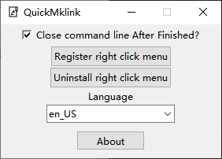
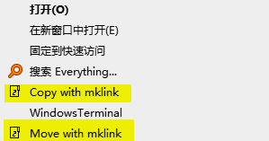
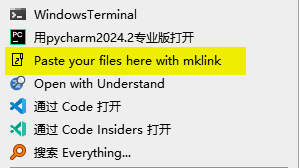

# QuickMklink

QuickMklink use right-click menus to provide almost the same operating habits as the original Window, so you can leave all other mklink tools behind and enjoy migrating your programs using mklink commands without interrupting your work.

  

  <h3 align="center">QuickMklink</h3>
  

    The mklink tool provides a native level of operating experience
     
    <a href="https://space.bilibili.com/282527875"><strong>Go to Author bilibili »</strong></a>
     
     

## Quick Start

I'll show you how easy it is to use QuickMklink to create a mklink symbolic link!

First register the context menu (only when the program is first started).

The options in the context menu appear, just like in the native window, and you can choose whether you want to copy or cut the folder.

Go to the destination folder and select Paste Files to paste or cut over the previous files

### Additional Notes

Copying a file and then pasting it is the original file remains unchanged, but sends a symbolic link to the target folder, often used instead of copying a large file, the file is not actually copied

Cut file is to move the original file to the target folder, and then create a symbolic link to the new location at the location of the source file, often used to move large files from C disk to other disks.

## Feature

- Simple, no dependencies and small size
- Intuitive API design
- Fast to use, no need to interrupt your workflow
- Multi-language support
- Multiple file/folder selection
- Move files the native way, and you can visualize the progress of the move.

## Run Locally

Execute `QuickMklink.py` after installing `requirement.txt` in the project root directory.

## Attention 

The program only supports Window10 and above and requires 64-bit system.
