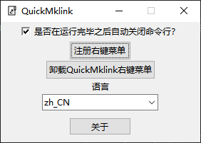
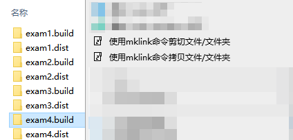
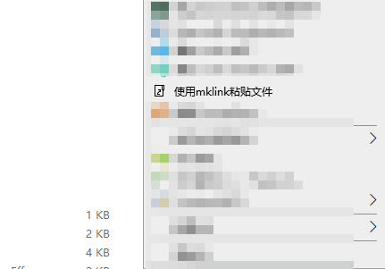

# QuickMklink

QuickMklink 提供右键菜单来提供和原版 Window 几乎一致的操作习惯，让您可以抛弃其他所有的 mklink 工具，享受在不打断您工作的情况下使用 mklink 指令迁移您的程序

  

  <h3 align="center">QuickMklink</h3>
  

    提供原生级别操作体验的mklink工具
     
    <a href="https://space.bilibili.com/282527875"><strong>前往作者B站 »</strong></a>
     
     

## 快速上手

我会向你演示使用 QuickMklink 来创建一个 mklink 的符号链接是一件多么简单的事情

首先注册一下右键菜单(仅在软件第一次启动的时候需要注册)

此时右键菜单的选项出现，和原生的 window 一样，选择您是需要拷贝还是剪切文件夹

前往目标文件夹，选择粘贴文件，就能把之前的文件粘贴或者剪切过来了

### 额外说明

拷贝文件后粘贴是原文件不变，而是发送一个符号链接到目标文件夹，常用来代替大文件的拷贝，实际上文件并没有被拷贝

剪切文件是将原文件移动到目标文件夹，然后在源文件的位置创建一个符号链接连接到新的位置，常用来给 C 盘搬家，将大文件移动到其他盘

## 特性

- 简单无依赖体积小
- 符合直觉的 API 设计
- 快捷的使用方式，无需打断您的工作流
- 多语言支持
- 支持多选文件/文件夹
- 使用原生系统的方式移动文件，您可以直观的查看移动进度

## 本地运行

安装项目根目录下的 `requirement.txt` 后执行  `QuickMklink.py` 即可

## 额外说明

该软件仅支持 Window10 及其以上的系统，同时需要系统位数为 64 位
